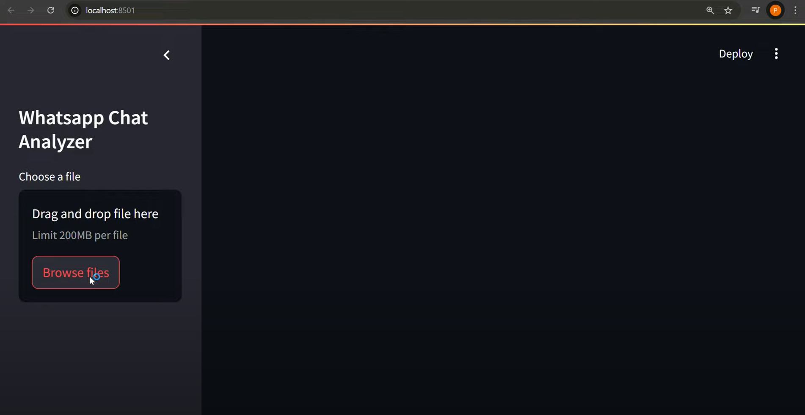

# Whatsapp-Chat-Analyzer

## Overview
The WhatsApp Chat Analyzer is a Python-based web application built with Streamlit that allows users to analyze their WhatsApp chat data. With this tool, you can extract meaningful insights such as:

### Demo Video

[](https://www.youtube.com/watch?v=TkqR9VZC2AA)


- **Message statistics**: Total messages, active participants, and time-based trends.
- **Most active users**: Identify the users who contribute the most.
- **Word frequency analysis**: Discover the most commonly used words.
- **Media sharing trends**: Understand how frequently media files are shared.
- **Emoji analysis**: Visualize the most commonly used emojis.
- **Daily/Monthly activity**: Analyze activity patterns over time.

## Features
- **Upload Chat File**: Easily upload your exported WhatsApp chat file in `.txt` format.
- **Interactive Visualizations**: Charts, graphs, and emoji clouds to make insights visually appealing.
- **User-friendly Interface**: Powered by Streamlit for a responsive and intuitive experience.

## Installation
Follow these steps to set up and run the project locally:

### Prerequisites
Ensure you have the following installed:
- Python 3.7 or later
- pip (Python package installer)

### Clone the Repository
```bash
git clone https://github.com/kfarjam90/Whatsapp-Chat-Analyzer.git
cd whatsapp-chat-analyzer
```

### Install Dependencies
Use the following command to install the required Python libraries:
```bash
pip install -r requirements.txt
```

### Run the Application
Start the Streamlit app with this command:
```bash
streamlit run app.py
```
This will launch the app in your default web browser.

## How to Export WhatsApp Chat
1. Open a chat in WhatsApp.
2. Tap on the three-dot menu (top-right corner) and select **More** > **Export Chat**.
3. Choose **Without Media** for smaller file sizes or **Include Media** if you want media links.
4. Save the `.txt` file and upload it to the analyzer.


*Add relevant screenshots here to showcase your app.*

## Technologies Used
- **Python**: For data analysis and backend logic.
- **Streamlit**: For creating an interactive web application.
- **Pandas**: For data manipulation and analysis.
- **Matplotlib & Seaborn**: For visualizations.
- **WordCloud**: For generating word cloud visualizations.

## Future Enhancements
- **Sentiment Analysis**: Analyze the overall sentiment of conversations.
- **Advanced Visualizations**: Introduce more complex and interactive visualizations.
- **Multi-language Support**: Support chats in multiple languages.
- **Chat Comparison**: Compare multiple chats for insights.

## Contributing
Contributions are welcome! Feel free to fork this repository, make changes, and submit a pull request.

## License
This project is licensed under the MIT License. See the [LICENSE](LICENSE) file for details.

---


